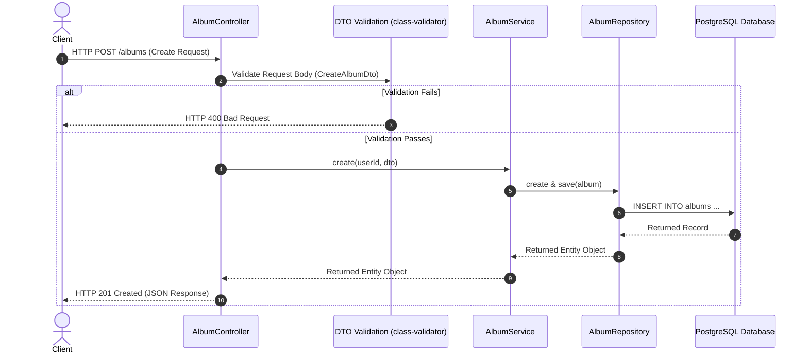

# 📘 Hướng Dẫn Đọc Codebase — Trace Request Flow (Module Album)

> **"Đừng đọc toàn bộ codebase. Chọn 1 feature nhỏ, rồi lần theo đường đi của một request từ lúc vào API tới lúc trả về response."**  
> Đây là cách nhanh nhất để onboard vào một dự án NestJS hoặc Express lớn trong vòng 15-30 phút.

---

## 1. Định Nghĩa Một Module

Trong NestJS, người ta gọi cả thư mục `album/` là **Album module**, bao gồm đầy đủ các lớp cấu trúc để xử lý dữ liệu:

```text
src/
└── album/
    ├── album.module.ts       ← Kết nối Controller, Service và Repository
    ├── album.controller.ts   ← Nơi nhận HTTP Request đầu vào
    ├── album.service.ts      ← Nơi xử lý Business Logic cốt lõi
    ├── dto/                  ← Định dạng và Kiểm duyệt dữ liệu (Validation)
    ├── entities/             ← Schema định nghĩa cấu trúc bảng Database
    └── repositories/         ← Lớp trung gian thực hiện các truy vấn Database
```

---

## 2. Bản Đồ Luồng Request (Request Flow Diagram)

Khi thực hiện trace luồng xử lý của một endpoint (ví dụ: `POST /albums`), dữ liệu sẽ đi qua các lớp bảo vệ và xử lý theo trình tự sau:



---

## 3. Lần Theo Dấu Vết Code (Code Tracing)

Hãy cùng đi qua từng lớp code thực tế của endpoint `POST /albums` để hiểu đường đi của dữ liệu:

### Bước 1: Request đi vào Controller
Tại file [album.controller.ts](file:///home/baudui/Projects/project/learnbe/src/00-index/01-codebase-reading-guide/album/album.controller.ts):
```typescript
@Post()
async create(
  @CurrentUser() user: { id: string; email: string },
  @Body() createAlbumDto: CreateAlbumDto,
): Promise<AlbumResponseDto> {
  // Lấy userId từ JWT Guard và dto đã qua validation pipe, truyền vào Service
  return this.albumService.create(user.id, createAlbumDto);
}
```

### Bước 2: Validation chạy qua DTO
Tại file [dto/create-album.dto.ts](file:///home/baudui/Projects/project/learnbe/src/00-index/01-codebase-reading-guide/album/dto/create-album.dto.ts):
```typescript
export class CreateAlbumDto {
  @ApiProperty({ description: 'The title of the album' })
  @IsString()
  @IsNotEmpty()
  title: string;

  @ApiPropertyOptional({ description: 'The artist of the album' })
  @IsString()
  @IsOptional()
  artist?: string;
}
```

### Bước 3: Xử lý Business Logic tại Service
Tại file [album.service.ts](file:///home/baudui/Projects/project/learnbe/src/00-index/01-codebase-reading-guide/album/album.service.ts):
```typescript
async create(userId: string, data: CreateAlbumDto): Promise<Album> {
  this.logger.log(`Creating new album for user: ${userId}`);
  const album = this.albumRepository.create({
    ...data,
    userId,
  });
  return this.albumRepository.save(album);
}
```

### Bước 4: Thực hiện Query thông qua Repository
Tại file [repositories/album.repository.ts](file:///home/baudui/Projects/project/learnbe/src/00-index/01-codebase-reading-guide/album/repositories/album.repository.ts):
```typescript
@Injectable()
export class AlbumRepository extends Repository<Album> {
  constructor(private readonly dataSource: DataSource) {
    super(Album, dataSource.createEntityManager());
  }
  // Thừa kế sẵn các hàm save(), find() từ TypeORM để lưu xuống DB
}
```

### Bước 5: Truy vấn Database thực tế
TypeORM sẽ chuyển đổi lệnh `.save()` thành câu lệnh SQL thuần để ghi xuống PostgreSQL:
```sql
INSERT INTO albums (id, title, artist, user_id, created_at, updated_at) 
VALUES ('uuid-v4-string', 'Album Title', 'Artist Name', 'user-uuid', NOW(), NOW());
```

---

## 4. Năm Điểm Cốt Lõi Khi Đọc Module

Bằng cách đi qua luồng request trên, ta có thể dễ dàng trả lời 5 câu hỏi kiến trúc cốt lõi của bất kỳ module nào:

1. **Request đi vào từ đâu?**  
   - Được định nghĩa tại lớp **Controller** thông qua các route decorators (`@Post()`, `@Get()`).
2. **Business logic nằm ở đâu?**  
   - Nằm trọn vẹn trong lớp **Service**, tách biệt hoàn toàn khỏi logic điều hướng API.
3. **Query DB nằm ở đâu?**  
   - Nằm ở lớp **Repository** (TypeORM/Prisma) giúp đóng gói các thao tác dữ liệu.
4. **Validation nằm ở đâu?**  
   - Nằm ở lớp **DTO** thông qua các decorator từ `class-validator` (hoặc schemas của Zod, Joi).
5. **Auth chạy ở đâu?**  
   - Chạy thông qua các **Guards** (ví dụ: `JwtAuthGuard`) hoặc **Middleware** để gán thông tin user vào request context.

---

## 5. Mẹo Thực Hành Trên IDE (VSCode)

Khi bạn được onboard vào một dự án lớn:
1. Tìm file router hoặc file controller của endpoint đơn giản nhất (ví dụ: `POST /albums` hoặc `GET /albums/:id`).
2. Dùng phím tắt **`Ctrl + Click`** (hoặc `Cmd + Click` trên Mac) vào từng phương thức:
   $$\text{Route/Controller} \xrightarrow{\text{Ctrl+Click}} \text{Service} \xrightarrow{\text{Ctrl+Click}} \text{Repository} \xrightarrow{\text{Ctrl+Click}} \text{Schema DB}$$
3. Việc lần theo dấu vết này giúp bạn hiểu cấu trúc toàn dự án chỉ trong vòng 15-30 phút mà không bị ngợp bởi hàng trăm file code khác.
